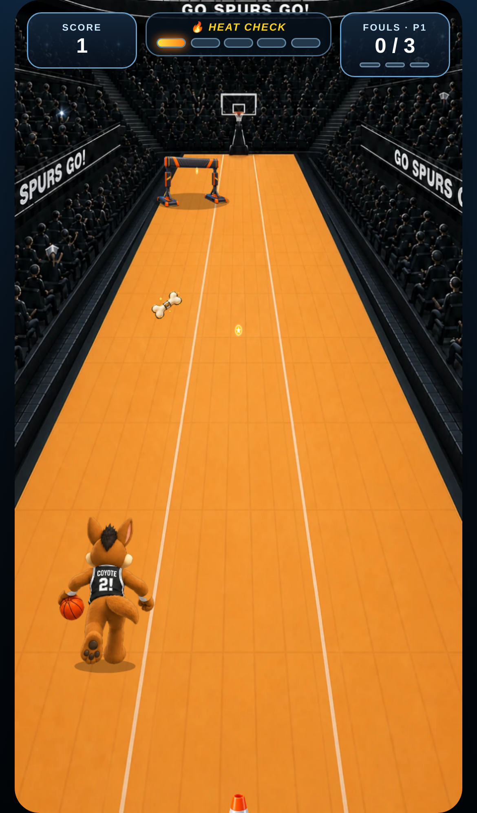

# Coyote's Fast Break

A three-lane runner built with React, TypeScript, and an HTML canvas renderer. It ships as a static Vite build that runs on the web and inside a mobile app WebView.



## Commands

```bash
npm install
npm run dev        # local development server
npm run verify     # lint + typecheck + unit tests + production build + headless phone e2e
npm run build      # production bundle in dist/
npm run preview    # serve dist/ locally
npm test           # unit tests only (vitest)
npm run test:e2e   # production smoke test in headless Chromium (needs a Chromium binary, see below)
```

Deploy the contents of `dist/` to any static host, CDN, or app bundle. Asset paths are relative, so the same build works at a domain root, under a sub-path, or from local files in a WebView.

## Code map

| File | Responsibility |
| --- | --- |
| `src/game/config.ts` | Every gameplay constant and the lane geometry, in one place |
| `src/game/geometry.ts` | Pure perspective math: lane centers, lane widths, lane-bounded sprite boxes |
| `src/game/model.ts` | Deterministic simulation: spawning, collisions, scoring, lane closures. No DOM |
| `src/game/renderer.ts` | Canvas drawing only. Reads state, never mutates it |
| `src/game/runtime.ts` | Fixed 120 Hz simulation loop, render interpolation, HUD change detection |
| `src/game/input.ts` | Keyboard and pointer swipe input |
| `src/game/audio.ts` | Synthesized sound effects |
| `src/ui/CoyoteFastBreak.tsx` | The React component that hosts the game and sizes it to its container |
| `src/ui/Hud.tsx`, `StartScreen.tsx`, `GameOverScreen.tsx` | React HUD and overlays |
| `scripts/prepare-assets.py` | Build-time art pipeline: checkerboard removal, frame registration, resizing, WebP output |
| `tests/` | Vitest unit tests for fairness, sprite containment, and determinism |
| `e2e/run.mjs` | Production smoke test under phone emulation with screenshots |

## What the app team asked for, and where it is handled

**Smoothness.** The simulation advances in fixed 1/120 s steps inside `runtime.ts`, independent of the display refresh rate, and the renderer interpolates between steps. There is no `shadowBlur`, no per-frame text rendering, and no per-frame gradient creation; the stadium is drawn once to an offscreen canvas, and coins, bones, and the heat glow are pre-rendered sprites. The React HUD only re-renders when a value actually changes, so DOM work never competes with canvas frames. The backing store is capped at 2x device pixel ratio.

**Blocks scaled properly and contained in their lane.** Every obstacle, pickup, and barrier is sized as a fraction of the lane width at its depth (`geometry.ts`, `spriteBox`). Growth stops at the player plane, so an item that has passed the player keeps sliding off-screen at a constant size instead of ballooning. `tests/geometry.test.ts` checks every kind at 150 depths in every lane and fails if any sprite edge leaves its lane.

**Lane closures never force a foul.** In `model.ts`:

- The previously closed lane reopens before the next warning starts, so two legal lanes always exist.
- The warning lasts 1.5 s. During it, nothing spawns, everything already in the closing lane becomes harmless, and anything in the center lane that would reach the player before the warning ends plus a 0.5 s grace period becomes harmless.
- A player still in the lane when it closes is pushed to the center with 0.8 s of protection. No foul is charged.
- Defenders can never occupy every live lane in the same depth band, so a dodge always exists.

`tests/fairness.test.ts` replays 12 seeded runs of 150 s each and asserts all of the above at every simulation step.

**Scales to phones.** The shell fits its container while keeping the portrait ratio, and it publishes a CSS variable (`--u`) that every HUD size is expressed in, so the HUD scales exactly like the canvas. Verified at 320x568, 390x844, 393x851, landscape 844x390, and 1280x800 (see `e2e/run.mjs`).

**Readable.** Modules are small, typed, and commented; `npm run lint` and `npm run typecheck` pass under strict TypeScript with React Hooks rules.

## Integration

### React web

```tsx
import { CoyoteFastBreak } from "./src/game";

<CoyoteFastBreak onGameOver={(summary) => console.log(summary.score)} />
```

The component fills its nearest positioned container. Pass `seed` for reproducible QA runs.

### React Native

Load the deployed build in a `WebView`. This keeps one tested implementation across web and app.

```tsx
import { WebView } from "react-native-webview";

<WebView
  source={{ uri: "https://your-cdn.example.com/coyote/index.html" }}
  allowsInlineMediaPlayback
  bounces={false}
  overScrollMode="never"
  onMessage={(event) => {
    const summary = JSON.parse(event.nativeEvent.data);
    // summary.score, summary.fouls, summary.possession, summary.distance
  }}
/>
```

To post the final score to the host app, wire `onGameOver` to `window.ReactNativeWebView?.postMessage(JSON.stringify(summary))` in `src/main.tsx`. A fully native renderer would be a separate React Native Skia project; the canvas code should not be transliterated.

## QA hooks

- `?seed=123` replays a fixed run.
- `?qa=1` exposes `window.__coyoteFastBreak.getState()` (read-only) for automation. Both are off unless present in the URL.

## Verification record

`npm run verify` on the current build:

| Check | Result |
| --- | --- |
| ESLint, strict TypeScript | clean |
| Unit tests (15) | pass |
| Production build | 245 kB JS (78 kB gzip), 142 kB sprites |
| Headless Chromium e2e, 5 device profiles | pass: no console errors, no overflow, HUD inside shell with no overlaps, swipe and key input verified, bot survives two lane closures with zero fouls |
| Frame cadence during play (4 s sample per profile) | avg 16.6 ms, p95 16.8 ms, 0 frames over 34 ms |

The frame numbers come from software-rendered headless Chromium, so real phones with GPU compositing have more headroom, not less.

The e2e script looks for Chromium at `/opt/pw-browsers/chromium-1194/chrome-linux/chrome`; set `PW_CHROMIUM_PATH` to point at another Chromium or run `npx playwright install chromium` and remove the `executablePath` line.

## Artwork

`art-source/` holds the production art: the eight frame rear-view run sheet, the six frame slide sheet, the title pose, the defender, cone, slide gate, dog bone, lane barrier, and the stadium plate. `scripts/prepare-assets.py` (Pillow with WebP) turns them into what the game loads:

- removes the checkerboard from the sprite sheets and deletes stray specks,
- cuts each sheet into frames and registers them on one shared cell size with a common ground row and centre line, so the animation never jitters,
- anti-aliases cutout edges, trims and resizes the obstacles, crops the stadium plate to the view's aspect with its far court on the horizon,
- writes WebP files plus `strips.json`, which tells the renderer the frame counts and cell sizes.

The jersey lettering ("COYOTE 2!") is brand art and is kept. Vite fingerprints every output file, so caches can never serve a stale sprite. `docs/ART-SPEC.md` documents the requirements for any future replacement art.

Screenshots of the verified build are in `docs/screenshots/`.
